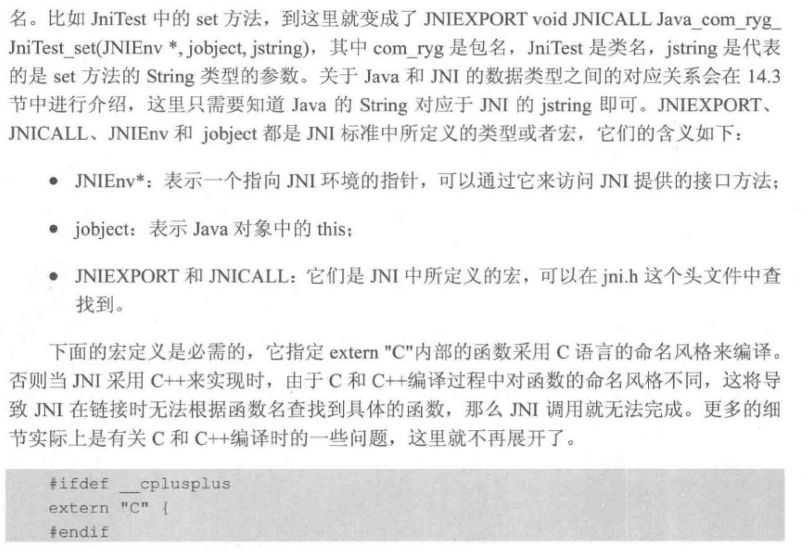

首先编写java 的类([如jni-usage](../src/JniHelloWorld.java))，其中包含`native` 方法  

然后编译出对应的class 文件

```shell
javac JniHelloWorld.java
```

然后用`javah` 根据class 文件生成对应的`.h` 文件，结果如[JniHelloWorld.h](../src/JniHelloWorld.h)

```shell
javah JniHelloWorld
```

关于生成方法，下面来自Android开发艺术探索的部分内容，对此简单进行了一些说明




然后用`javah` 根据class 文件生成对应的`.c` 文件（jdk 13 没有对应功能了，所以选择手写）

> 这里查了下文档，7 的时候还有 -stubs 参数，之后应该就没了
>
> 9 javah 文档说即将废弃，用javac -h 来实现，也没提到stub

编写一个[c 代码类](../src/JniHelloWorld.cpp)，注意依赖`jni.h`, `jni_md.h`，在`JAVA_HOME` 和 `JAVA_HOME\include\(system_dir)\`    

然后使用gcc 编译

```shell
gcc -c JniHelloWorld.cpp 
```

再输出为共享库

```shell
gcc -dynamiclib -o libhello.jnilib JniHelloWorld.o
```

注意这里的`jnilib` 后缀是mac 的

然后把jnilib 放入`java.library.path` 中的目录，如`/Library/Java/Extensions`  

此时便可以运行了。但是奇怪的是

先用printf 先打印的，却在控制台里较后输出。

